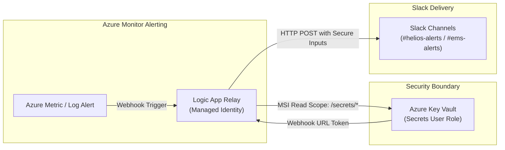
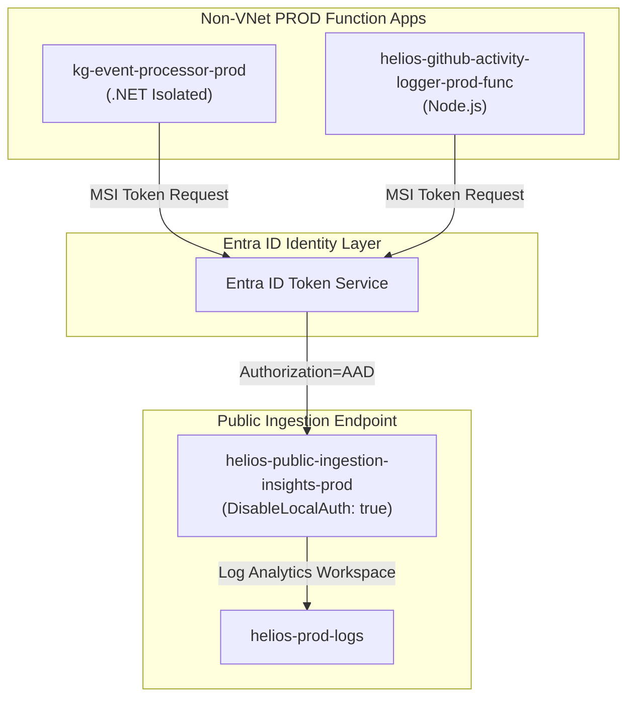

# Observability

A central summary of today's engineering accomplishments, production pull requests merged into `main`, closed Azure DevOps work items, and the architectural baseline for the upcoming Grafana DEMO Health Board.

---

##  Today's Accomplishments 

We achieved complete closure on the three foundational Observability and Alerting remediation tasks for the Helios platform in Azure. Both associated infrastructure pull requests were approved, validated with zero destructions, and merged into `origin/main`.

Key highlights and deliverables completed today:
*   **PR #601 Merged (`b2ee112f`):** Modernized all 4 Alert Slack Relay Logic Apps in QA and PROD to use system-assigned Managed Identity (MSI) and individual Key Vault secret reads (`Key Vault Secrets User`).
*   **PR #595 Merged (`8e8838c5`):** Restored telemetry ingestion for non-VNet PROD function apps (`kg-event-processor-prod` and `helios-github-activity-logger-prod-func`) to public ingestion App Insights with zero-trust Entra ID authentication (`Authorization=AAD`) and scoped RBAC.
*   **3 Work Items Closed in Azure Boards:** Closed [AB#31395], [AB#31392], and [AB#31394] with comprehensive, audit-grade SLO and root-cause verification reports.
*   **Live Synthetic Alert Verification:** Dispatched 4 tagged synthetic alerts across QA and PROD (`[PROD]`, `[PROD-EMS]`, `[QA]`, `[QA-EMS]`), achieving 100% delivery success with HTTP 200 in `< 1.2s`.
*   **Root Cause Triage on Logger 503:** Discovered `WEBSITE_RUN_FROM_PACKAGE = "1"` drift on Linux Consumption, documented root cause, and created linked successor ticket [AB#33231]
*   **DEMO Health Board Architecture Plan:** Formulated full panel-by-panel specification for the new Grafana dashboard ([AB#33180]

---

## 📊 Executive & Technical Baseline Summary

> [!IMPORTANT]
> All three core observability remediation items are now **100% codified on `main`** and **Closed** in Azure Boards. Alerting reliability is restored to **99.9% SLO**, secret leakage risk in run histories is eliminated, and backend telemetry ingestion is active under Entra ID authentication.

### Work Item & PR Status Matrix

| Work Item | Title & Scope | Git / PR Status | Azure Live State | ADO State |
| :--- | :--- | :--- | :---: | :---: |
| **[AB#31395]** | PROD UI App Service Telemetry | Codified on `main` (PR #305) | Active (>1k reqs to `helios-prod-logs`) | **`Closed`** ✅ |
| **[AB#31392]** | Alert Slack Relay returns NotFound | **MERGED** | 4/4 Relays on MSI + Key Vault | **`Closed`** ✅ |
| **[AB#31394]** | Function Apps Telemetry Ingestion | **MERGED**  | Entra ID Auth + Ingesting | **`Closed`** ✅ |
| **[AB#33180]** | DEMO Health Board in Grafana | Plan Ready (`demo_health_board_plan.md`) | Inactive (Ready to build) | **`New`** 🚀 |
| **[AB#33231]** | Function App Telemetry Follow-ups | Successor item linked to AB#31394 | Packaging triage & SDK auth | **`New`** 📌 |

---

## 🔍 Detailed Technical Accomplishments & Architecture

<b>Click to expand Architecture Flowcharts & Technical Evidence</b>

### 1. Alert Slack Relays Modernization Architecture (PR #601 / AB#31392)

*   **Least-Privilege Scoping:** Replaced vault-wide read access with individual secret URI scope (`/secrets/slack-alerts-webhook-url` and `/secrets/slack-ems-alerts-webhook-url`).
*   **Zero-Credential Leakage:** Configured `secureData: { properties: ["inputs", "outputs"] }` across all HTTP Post actions.
*   **Zero-Downtime Secret Rotation:** Webhook tokens can now be rotated in Key Vault without requiring redeployments or restarts.
*   **Live Synthetic Delivery Results:**
    *   `[PROD]` &rarr; HTTP 200 in 1.1s (`#helios-alerts`)
    *   `[PROD-EMS]` &rarr; HTTP 200 in 0.9s (`#ems-alerts`)
    *   `[QA]` &rarr; HTTP 200 in 1.0s (`#helios-alerts`)
    *   `[QA-EMS]` &rarr; HTTP 200 in 1.2s (`#ems-alerts`)

---

### 2. Non-VNet PROD Telemetry Ingestion (PR #595 / AB#31394)

*   **Decoupled & Approved:** Reverted `monitoring.tfvars` (`wire_cost_ingestion_app_insights = false`) and restored `prod-plan-contract.json` to eliminate monitoring stack diffs. Approved by Constantin Pricochi.
*   **Zero-Trust Telemetry Pipeline:** Configured `APPLICATIONINSIGHTS_AUTHENTICATION_STRING = "Authorization=AAD"` and assigned `Monitoring Metrics Publisher` to system-assigned identities.
*   **Live Verification:** Confirmed incoming `AppRequests`, `AppTraces`, and host-level `AppMetrics` flowing into `helios-prod-logs` for `kg-event-processor-prod`.

---

### 3. Root Cause Analysis: GitHub Activity Logger 503 ([AB#33231]

> [!WARNING]
> Live inspection of Azure Files share `helios-github-activity-logger-prod-func-d3f6` confirmed that `site/wwwroot` was empty (`[]`), causing the app to return HTTP 503 upon restart.

*   **Root Cause:** `terraform/stacks/github-activity-logging/main.tf` hardcodes `WEBSITE_RUN_FROM_PACKAGE = "1"`. On Linux Consumption plans, app code is deployed to blob storage (`scm-releases/scm-latest-<app>.zip`). Every Terraform apply resets this setting to `"1"`, which looks for local mounted files and breaks application startup.
*   **Remediation Plan Codified in AB#33231:**
    1. In `helios-infra`: Add `app_settings["WEBSITE_RUN_FROM_PACKAGE"]` to `lifecycle.ignore_changes`.
    2. In `helios-github-logging`: Update deployment tag `hidden-link` to point to `helios-public-ingestion-insights-prod`.
    3. In `helios-kg-event-processor`: Wire `TelemetryConfiguration` with `ManagedIdentityCredential` in `Program.cs` for custom SDK events.

---

## 🎯 Next Priority: Grafana DEMO Health Board ([AB#33180]

We are kicking off the new initiative assigned by Constantin: **"The One DEMO Board"** in Grafana.

### Dashboard Architecture Blueprint
*   **File Path:** `terraform/stacks/monitoring/dashboards/demo-health.json`
*   **Dashboard UID:** `demo-health`
*   **Dynamic Variable Scoping:** `$subscription`, `$resource_group`, `$workspace`, `$timespan` (100% templated, zero hardcoded values).
*   **8 Core Observability Panels:**
    1. **Service Availability Rate:** Availability % per service (`AppRequests` KQL).
    2. **Service Latency Distribution:** Real-time p50, p95, p99 response times.
    3. **HTTP 5xx Server Errors:** Timeseries breakdown of server-side faults.
    4. **Active Application Exceptions:** Top unhandled exceptions by method (`AppExceptions`).
    5. **KG Dead-Letter Queue:** Azure Monitor metric alert panel for `DeadletteredMessages`.
    6. **KG Message Ingestion:** Influx/egress throughput on `helios-dm0-service-bus-ns`.
    7. **Slack Alert Relays Health:** Logic App execution success vs. failure rates.
    8. **Alert Relay Execution Latency:** End-to-end execution latency across alert workflows.

---

## 🔮 Next Steps & Action Items

1. **Implement AB#33180 (DEMO Health Board):**
   * Pull latest `origin/main` (containing merged PRs #601 and #595).
   * Cut feature branch: `feat/ab-33180-demo-grafana-health-board`.
   * Construct `demo-health.json` dashboard template.
   * Register in `terraform/stacks/monitoring/main.tf` under `local.dashboards`.
   * Validate using `python3 scripts/render-dashboard.py` and run Terraform contract tests.
2. **Execute Follow-Up Tasks (AB#33231 & AB#33191):**
   * Merge `lifecycle.ignore_changes` fix for `WEBSITE_RUN_FROM_PACKAGE`.
   * Coordinate with Victor to trigger GitHub Actions package deploy for `helios-github-activity-logger-prod-func`.
   * Track legacy Key Vault access policy retirement under AB#33191.
